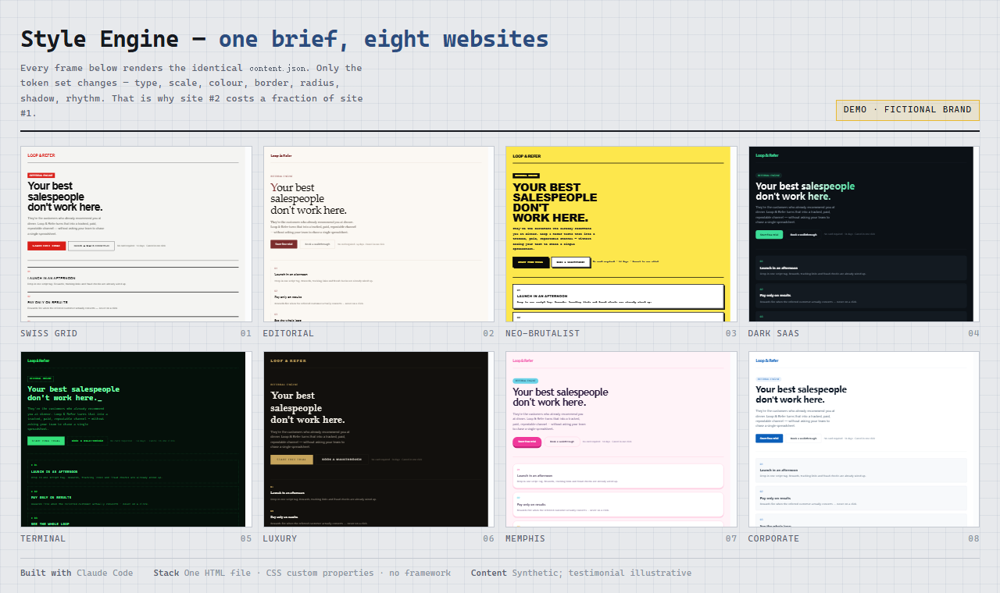

# Style Engine — one brief, eight websites

**[Open the live demo →](PAGES_URL)**



A client sitting on a 2,000-style reference library doesn't have a design problem. They have a **throughput** problem: a beautiful site #1 is worthless if site #2 costs exactly the same to build.

So this demo separates the two things that usually get welded together.

| | |
|---|---|
| **Content** | Lives in one `content.json` — copy, sections, proof points. Written once. |
| **Style** | A token set: type stack, scale, tracking, colour system, border weight, radius, shadow, rhythm. ~40 variables. |
| **Components** | One set. Shared by every style. Never rewritten per client. |

Swap the token set and the entire site re-derives — **markup untouched, copy untouched**. Click through the eight directions in the demo: Swiss, editorial, neo-brutalist, dark SaaS, terminal, luxury, Memphis, corporate. The words never change. Everything else does.

That is the difference between *2,000 styles* and *2,000 separate jobs*.

## How a new style gets added

1. **Read the reference** — a competitor site, a screenshot, a brand deck.
2. **Extract it into tokens** — not "make it look like this", but a concrete `tokens.json`: which typefaces, what scale ratio, how tight the tracking, how hard the shadow.
3. **Bind and render** — the existing component set consumes the tokens. No bespoke markup.
4. **Review** — contrast, focus states, mobile pass, then a human signs off. Every time.

Steps 1–3 are a reusable Claude Code skill, which is what makes site #2 through #100 cheap. Step 4 never gets automated away.

## Notes on what's real

- **The brand is fictional.** "Loop & Refer" does not exist. The copy is synthetic and the testimonial is illustrative — it is labelled as such on the page itself.
- **The engineering is real.** One HTML file, CSS custom properties, no framework, no build step, no external requests. Both light and dark shells. Keyboard navigable (`←` / `→`). Deep-linkable per style (`#brutal`, `#luxury`, …).
- **Built with Claude Code**, end to end, in an afternoon.

## Files

```
index.html               complete standalone page — open it, or host it anywhere
contact-sheet.html       the eight-up sheet used for the cover image
cover-contact-sheet.png  1280×760 contact sheet
screenshots/             1440×1150 capture of each style
```

No dependencies. No build. Open `index.html` in a browser and it runs.
